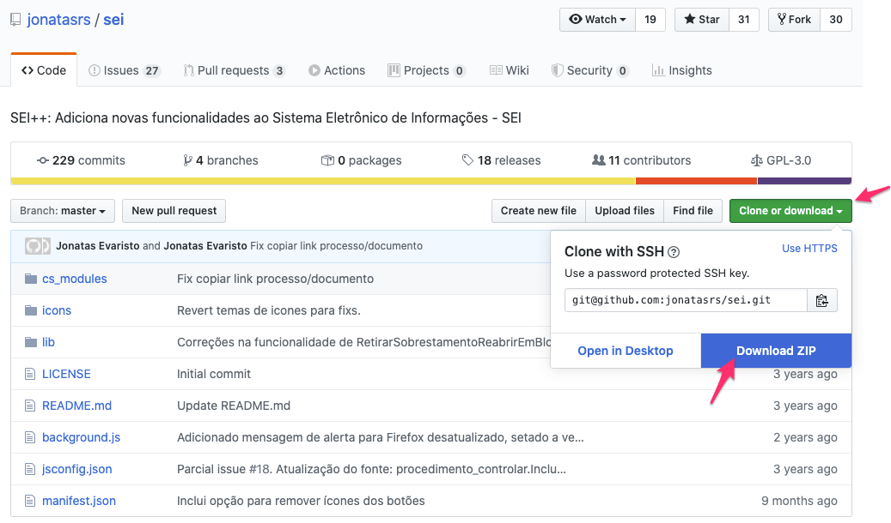

Nesta lição vamos construir um [mapa conceitual](https://pt.wikipedia.org/wiki/Mapa_conceitual) sobre o Github. O mapa completo [está disponível](<https://app.diagrams.net/#G1KVuDAjSir8Vvkw_p5wxZueIQ9xKm3BYn>), mas a construção gradativa vai ajudar a solidificar o conhecimento. Após a finalização do [setup inicial]({{ page.root }}), nós já sabemos que

No GitHub os _repositórios pertencem a usuários_. Conjugando essa informação com a discussão sobre arquivos que fizemos na lição sobre [organização de projetos]({{ page.root }}) e o fato de que o GitHub oferece o serviço de hospedagem de repositórios, nosso mapa conceitual pode ser atualizado para

Para exemplificar as funcionalidades do GitHub vamos utilizar o [projeto SEI++](https://github.com/jonatasrs/sei). O SEI++ é uma extensão para os navegadores [Firefox](https://developer.mozilla.org/en-US/docs/Mozilla/Add-ons/WebExtensions/Your_first_WebExtension) e [Google Chrome](https://developer.chrome.com/extensions) que adiciona novas funcionalidades ao Sistema Eletrônico de Informações - SEI, facilitando a navegação e a utilização do mesmo. 

> ## Make things open: it makes things better
>
> O SEI++ é um projeto desenvolvido pela comunidade que traz benefícios para diversos servidores públicos, sendo inclusive sugerido no [material de treinamento](http://planejamento.mg.gov.br/sites/default/files/documentos/gestao-governamental/gestao-de-ti/apresentacao_sei_avancado_0.pptx) do Curso SEI Avançado ofertado pela [SEPLAG](http://www.planejamento.mg.gov.br/pagina/gestao-governamental/sei/sistema-eletronico-de-informacoes). 
>
> Esse benefício nunca teria se realizado caso o desenvolvedor original, um servidor público, não tivesse escolhido compartilhar seu trabalho com outros.
> Além disso, ele recebou auxílio no desenvolvimento do projeto de outras 10 pessoas.
> 
> Esse é um exemplo concreto da melhoria esperada com a co-criação e compartilhamento defendido no [10º princípio de design de serviços do Reino Unido](https://www.gov.uk/guidance/government-design-principles).
{: .callout}

No Github, os arquivos do [projeto SEI++](https://github.com/jonatasrs/sei) podem ser visualizados na aba Code

É possível navegar pelas pastas, e, ao selecionar arquivos específicos, é possível visualizar seu conteúdo

Também é possível baixar todos os arquivos do projeto por meio da opção Download Zip.

Consulte a [documentação](https://help.github.com/pt/github/managing-files-in-a-repository) para mais informações sobre o gerenciamento de arquivos utilizando a interface do GitHub.

> ## Hello Word!
>
> Para completar essa atividade é necessário que o setup inicial tenha sido finalizado e você esteja logado em sua conta no GitHub. 
> Nosso objetivo é criar nosso primeiro repositório. 
> Para isso, siga as instruções abaixo:
> 
> 1. Naveque para <https://github.com/new>;
> 1. Digite `hello-word` como nome do repositório;
> 1. Selecione a opção __Initialize this repository with a README__;
> 
> 1. Clique em __Create repository__.
>
> Faça o download do repositório para o seu computador e inspecione o conteúdo do arquivo `README.md` no Bloco de notas (Notepad) ou seu [editor de texto](https://en.wikipedia.org/wiki/Text_editor) preferido. 
> 
{: .challenge}

> ## Editores de texto
> 
> Os arquivos com extensão `.md` são arquivo de texto, e, portanto, conforme discutido na lição sobre [organização de projetos]({{ page.root }}), não devem ser visualizados no Microsoft Word.
{: .callout}

